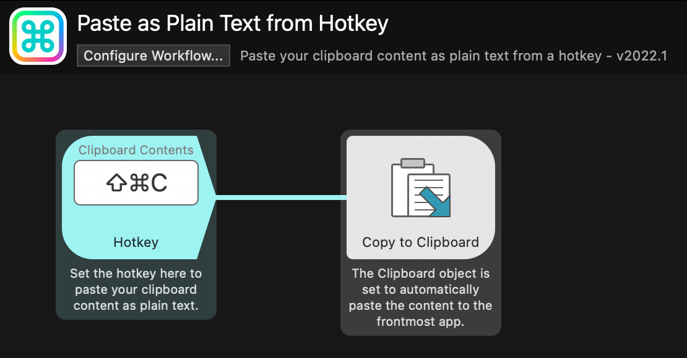

# Paste as Plain Text

This very simple workflow allows you to set a hotkey to paste the contents of your macOS clipboard as plain text, stripping it of any formatting.

[⤓ Install From the Alfred Gallery](https://alfred.app/workflows/alfredapp/paste-as-plain-text-from-hotkey/)

## Usage

Double-click the Hotkey object and set a hotkey combo of your choice.

The workflow assumes that you've already granted Alfred the necessary Accessibility permissions:
https://www.alfredapp.com/help/getting-started/permissions/
